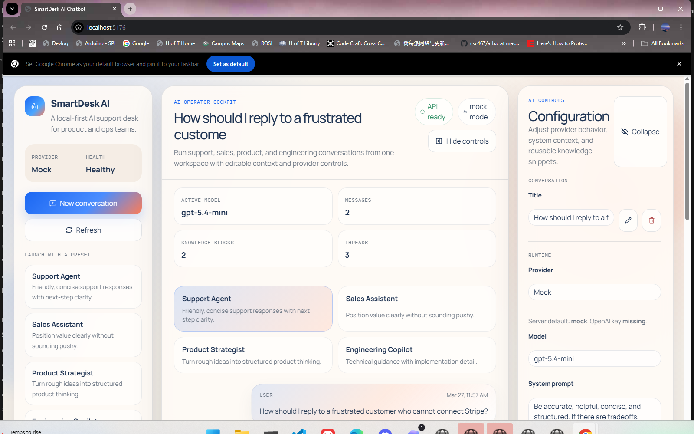
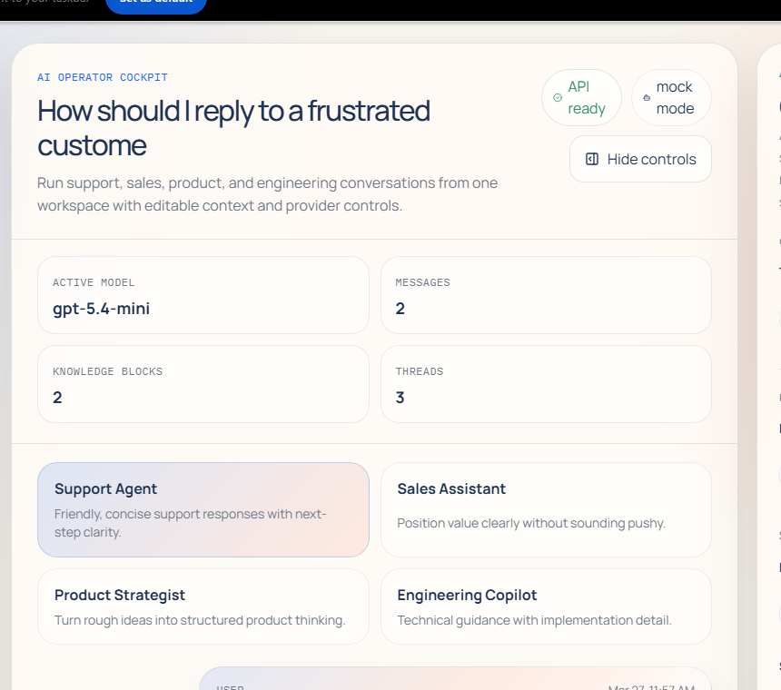
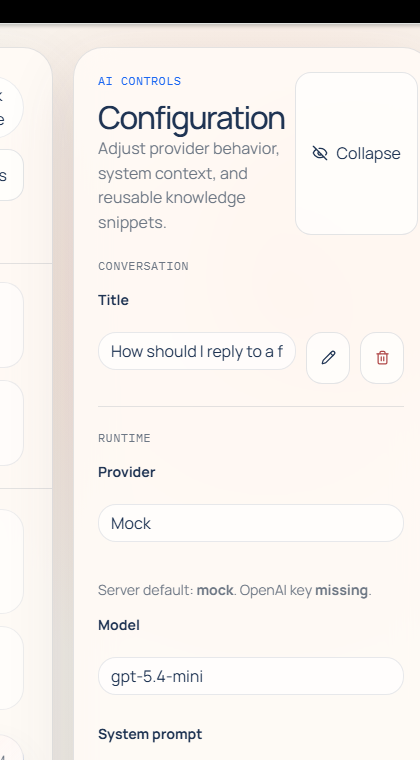

# SmartDesk AI Chatbot

SmartDesk AI Chatbot is a full-stack demo application that packages a polished React workspace together with an Express and TypeScript API for conversation management, streaming replies, preset-based prompting, and editable knowledge snippets.

The project is designed to be easy to run locally in WSL, easy to review, and easy to extend into a more production-oriented AI workspace.

## Main features

- Multi-conversation workspace with saved threads
- Streaming assistant replies with mock and live OpenAI modes
- Preset-specific chat flows for support, sales, product, and engineering
- Editable system prompt and reusable knowledge snippets
- File-backed persistence for frictionless local development
- Local-first setup with separate client and server apps

## Screenshots

### Workspace overview



### Chat workspace



### Settings panel



## Architecture overview

### Client

The frontend lives in `apps/client` and uses React, TypeScript, and Vite. The UI is split into focused modules:

- `App.tsx`: state orchestration and API integration
- `components/ConversationRail.tsx`: brand, quick-start presets, and saved threads
- `components/ChatWorkspace.tsx`: active transcript, prompt suggestions, and composer
- `components/SettingsPanel.tsx`: provider, prompt, and knowledge controls
- `api.ts`: typed browser API wrapper

### Server

The backend lives in `apps/server` and uses Express with small service modules:

- `routes.ts`: HTTP endpoints and request validation
- `services/conversationService.ts`: conversation CRUD and message persistence
- `services/settingsService.ts`: AI settings updates
- `services/mockAiService.ts`: local mock streaming responses
- `services/openAiService.ts`: optional OpenAI Responses API integration
- `storage.ts`: local JSON database bootstrap and persistence

## Tech stack

### Frontend

- React
- TypeScript
- Vite
- Bootstrap 5
- Lucide React

### Backend

- Node.js
- Express
- TypeScript
- OpenAI Node SDK
- Zod
- UUID

## Repository structure

```text
smartdesk-ai-chatbot/
  apps/
    client/
      src/
        components/
        api.ts
        App.tsx
        formatters.ts
        promptSuggestions.ts
        styles.css
    server/
      src/
        services/
        config.ts
        index.ts
        presets.ts
        routes.ts
        storage.ts
      data/
  docs/
    screenshots/
  package.json
  README.md
```

## Dependency requirements

- Node.js 20+ recommended
- npm 10+ recommended
- WSL/Linux shell environment recommended for local work on Windows

## Environment setup

### 1. Install dependencies

```bash
npm install
```

### 2. Create the server environment file

```bash
cp apps/server/.env.example apps/server/.env
```

### 3. Optional: enable live OpenAI mode

Edit `apps/server/.env` and set:

```env
PORT=4000
CLIENT_ORIGIN=http://localhost:5173
AI_PROVIDER=openai
OPENAI_API_KEY=your_key_here
OPENAI_MODEL=gpt-5.4-mini
```

If you do not set `OPENAI_API_KEY`, the application works in mock mode by default.

## How to run

### Start both apps together

```bash
npm run dev
```

### Start the apps separately

Backend:

```bash
npm run dev -w apps/server
```

Frontend:

```bash
npm run dev -w apps/client
```

## Local URLs

- Frontend: `http://localhost:5173`
- Backend API root: `http://localhost:4000`
- Backend health endpoint: `http://localhost:4000/api/health`

## Build, lint, and validation commands

Build everything:

```bash
npm run build
```

Lint and typecheck:

```bash
npm run lint
```

Run the production server build:

```bash
npm run start
```

## Testing

There is currently no dedicated automated test suite. For now, validation is done with:

- `npm run lint`
- `npm run build`
- manual verification of the local chat flow in the browser

## Configuration notes

- The client reads the API base URL from `VITE_API_URL` and falls back to `http://localhost:4000/api`.
- The server stores data in `apps/server/data/db.json`.
- Conversation preset changes, renames, settings updates, and streamed replies are all persisted through the server API.
- The mock provider is useful for demos, CI smoke checks, and recruiter review without secrets.

## Example usage

1. Start the app locally.
2. Create a new conversation with a preset such as `Support Agent` or `Engineering Copilot`.
3. Use a starter prompt or write your own brief.
4. Update the system prompt or knowledge snippets in the control rail.
5. Switch to OpenAI mode after adding a valid API key if you want live model output.

## Troubleshooting

- If the client shows API errors, confirm the server is running on port `4000`.
- If CORS requests fail, verify `CLIENT_ORIGIN` in `apps/server/.env`.
- If OpenAI mode does not respond, confirm `OPENAI_API_KEY` is set and `AI_PROVIDER=openai`.
- If local data feels stale, remove `apps/server/data/db.json` and restart the backend to regenerate the seed file.
- If ports `4000` or `5173` are in use, stop the conflicting process or adjust the port configuration.

## License

MIT
